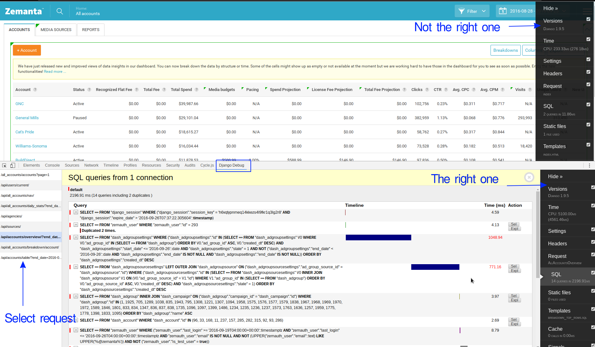

# Zemanta Eins

Nachfrageseite-Plattform (en: **Zemanta One** - A Demand Side Platform.)


## Architecture Overview

For the description of core concepts and architecture diagrams, please view [docs/ARCHITECTURE.md](docs/ARCHITECTURE.md).


## Code Organization

Code is organized in two main units:
* server: contains all the server side code, that is database and the API built with Django.
* client: a web application built with AngularJS & Angular. The client connects to server via the API.

### Server

For the description of how the server code is organized and written, please view [docs/conventions/BACKEND.md](docs/conventions/BACKEND.md).

### Client

For the description of how the client code is organized and written, please view [docs/conventions/FRONTEND.md](docs/conventions/FRONTEND.md).

## How To Setup

- clone this repository
- make sure you have `git` and `docker`, `docker-compose` installed (tested with Docker CE 17.06.0 on both Linux & macOS)
- (optional) if you want to be able to build the docker images locally, you have to run `docker run -d --restart=always -v /var/run/docker.sock:/var/run/docker.sock:ro --privileged --net=host robbertkl/ipv6nat` (from [robbertkl/docker-ipv6nat](https://github.com/robbertkl/docker-ipv6nat) to be able to access artifactory.outbrain.com via Meta VPN
- make sure `awscli` is installed and AWS credentials configured (test with `aws s3 ls s3://z1-demo/`)
- run `make pull` (in addition to AWS keys, you need to specify a region e.g. "us-east-1")
- create the network zemanta using `docker network create zemanta`
- run `make run`
- run `make reset_local_stats_database` to set up your local stats postgres DB for development (can take a while - 5-10min, grab some coffee)
- run `make reset_local_database` to set up your local postgres DB for development (can take a while - 5-10min, grab some coffee)

Now you have a running local setup of Z1, accessible at [http://localhost:8000](http://localhost:8000).
You can log in with u/p `test@test.com` / `test123`.

The code you have locally is mounted into the docker containers, so you can edit the files locally. For running tests (either server or client),
first `exec` into the appropriate container (`docker-compose exec server bash` for server, `docker-compose exec client bash` for client) and
then run the appropriate test commands (`./manage.py test` for server, `npm run tests` for client).

### Utilities

#### Run without the client container

Due to high memory usage of the client container there is an option to run the project without it (e.g. when working on backend only):

```
make run_clientless
```

#### Pull images from a specific branch

Sometimes it is tedious to rebuild images locally thus there is an option to pull images from a specific branch:

```
make pull PULL_TAG=the_branch_name
```

### Server specifics

#### Work with a copy of the production DB (pg01)
To use a copy of the production DB on the local network instead of a local postgres container, run
```
DB=pg01 make run
```

#### Overriding docker's localsettings
To override a setting when running server via docker, use the file `server/server/localsettings_docker_override.py`. It is loaded at the end of `localsettings.docker.py` and will override the preset values with your settings.


#### Visualize models
```bash
python manage.py graph_models -a -g -o my_project_visualized.png
```

### Client

When using the Docker setup, static files are watched and recompiled automatically as you edit them. In case you want to control how npm is run (for example for developing whitelabels), please run

```
CLIENT_SKIP_RUN=1 make run
```

and after that, you can use `docker-compose exec client bash` to get a bash session inside the client container. There, you can run npm scripts yourself, e.g. `npm run dev`.
To test a specific whitelabel run within the client `npm run dev --theme=YOURTHEME`.
Be aware that the the whitelabel must NOT be assigned to an agency, otherwise it won't work!


#### Manual setup (legacy)

We use Grunt for building the app and Bower for management of third-party components. Third-party components are part of the repository and are to be committed while node modules used with Grunt are only develoment dependencies and are not to be committed.

All the commands bellow assume that you are located in client subdirectory.

Make sure that you have node.js, npm and bower installed.

Install local development node modules:
```bash
npm prune
npm install
bower install --dev
```

Now you have all the development dependencies installed so you can run `dev` target and start with development.
This will run server on port 9999 and will rebuild bundles after each change to source file:
```bash
npm run dev
```

To create product bundle run `prod` target along with `--build-number` parameter. This will rewrite all
media urls to point to `one-static.zemanta.com/<build-number>`. It will also build all whitelabel styles (greenpark and adtechnacity).
```bash
npm run prod --build-number=123
```

## Debugging & Profiling

### Django Queryinspect

When running your app, django-queryinspect will print SQL statistics to stdout. It will notify you if you have duplicated queries (e.g. you probably need a `select_related` or `prefetch_related`).

### Shell plus

If you want to see the SQL queries being run in real-time from the shell, you can use `./manage.py shell_plus --print-sql`.

### Django Debug Toolbar

The debug toolbar will help you profile your code and templates, find slow and duplicated queries, find if cache is hit or miss etc.

The debug toolbar is shown as a part of developemnt z1 client app. This toolbar is not meant for one page apps (it doesn't refresh for ajax requests)
and thus we need to install a [debug toolbar panel chrome extension](https://chrome.google.com/webstore/detail/django-debug-panel/nbiajhhibgfgkjegbnflpdccejocmbbn) that will
show the panel in a separate developemnt tools tab for every request we make. If the one behind the given link doesn't work for you
try with [this fork](https://github.com/perython/chrome-django-panel/tree/master) - it solves display problems and at the time I was writting this it wasn't yet merged
into the master panel.




### Profiling

You can send a SIGUSR2 signal to a process to start profiling and another one to stop. e.g. `kill -s SIGUSR2 <pid>` and after a while, `kill -s SIGUSR2 <pid>`. After the second call, the profile will be dumped to disk. You can view the file with https://nejc.saje.info/pstats-viewer.html .

Jobs can be profiled by using a `PROFILER=1` environment variable, e.g. `PROFILER=1 ./manage.py dcron_launcher monitor_demo`.


## Linting and formatting

We have [flake8](http://flake8.pycqa.org/en/latest/), [black](https://github.com/ambv/black), [eslint](http://eslint.org/docs/rules/) and [tslint](https://palantir.github.io/tslint/) checks set up on circle CI. Also we have [Prettier](https://prettier.io/) as an opinionated code formatter. The build will be unsuccessful if you will commit unconventional code.

It's a good idea to set up flake8, black, eslint, tslint and prettier inside your editor. For convenience there's a pre-commit hook in the repo that automatically formats Python code with *black*, performs lint checks on Javascript (*eslint*) and Typescript (*tslint*) files and formats client code-base with *Prettier*.

To setup the pre-commit hook you'll first need [pre-commit](https://pre-commit.com/) package manager installed. Run `pip install pre-commit`.

Then install the pre-commit hook by running `pre-commit install` in project's root.


## Documentation

Documentation for the REST API is built on CI and deployed to dev.zemanta.com by deploykitty whenever Z1 is deployed.
When modifying or changing its theme, you can run a preview server with `make preview_docs`. The server with the preview starts on `http://0.0.0.0:3000/`.
If you don't have `zemanta/z1-aglio` docker image built yet, build it with `docker build -t zemanta/z1-aglio -f docker/Dockerfile.z1-aglio docker/` run from the root of the repo.


## Testing

### Client

#### Unit testing

We use Jasmine as testing framework and Karma as test runner with PhantomJS.
Tests can be run with:
```bash
npm run tests
```

Karma can also auto-watch files and run test on every change:
```bash
npm run tests-watch
```

### Server

In the case you are using staging or other database for running Z1 locally running unit tests can become
very slow. You can provide additional entries in your DATABASES dictionary with prefix 'testing\_'. When
running tests these configuration entries will have the prefix 'testing\_' removed and will replace existing
entries in LOGGING setting.

And example config for using staging when running with ./manage.py runserver and local database for unit testing.

```python
DATABASES = {
	'default': {
		'ENGINE': 'django.db.backends.postgresql_psycopg2',
		'NAME': 'dev',
		'HOST': 'staging-host.com',
		'USER': 'staging',
		'PASSWORD': '...',
		'PORT': 5432
	},
	'testing_default': {
		'ENGINE': 'django.db.backends.postgresql_psycopg2',
		'NAME': 'z1',
		'USER': 'z1',
		'PASSWORD': '...',
		'PORT': 5440
	}
}
```

You can also speed up the test suite by using `--parallel` flag. In order to
reap the most benefits, you can also use `--keepdb` flag to avoid setting up
test databases on every test run. When using `--keepdb`, the
`--skip-transaction-tests` should also be used. It was created as a workaround
for transaction tests truncating tables after they run. Since a part of app data
is loaded into the databases using data migrations, it will be missing on the
next run if the flag is not used. The flag will likely be obsolete when
https://code.djangoproject.com/ticket/25251 is closed.

The final command would then look like
```bash
./manage.py test --keepdb --parallel --skip-transaction-tests
```

### REST API Acceptance testing

REST API is using [dredd](https://github.com/apiaryio/dredd) for acceptance testing.
Dredd parses the api_blueprint.md file and executes the payloads against a test server.

It checks the returned JSON for conformity. **ATTENTION**: It doesn't check the content
of the JSON, just the schema! E.g. the JSON must contain all fields etc -
[more on what it checks](http://www.relishapp.com/apiary/gavel/docs/expectations/body-json-example)).
This means that the documentation and the fixtures don't have to match 100%.

#### Debugging acceptance tests

```
export ACCEPTANCE_IMAGE="569683728510.dkr.ecr.us-east-1.amazonaws.com/zemanta/z1"
docker-compose -f docker-compose.yml -f docker-compose.acceptance.yml up --force-recreate -d
```

then exec into server container:

`docker exec -it zemanta-eins_server_1 bash`

and run inside:

`python test-server.py server:8124 --keepdb --autoreload`

Then you can run acceptance tests with

`docker-compose -f docker-compose.yml -f docker-compose.acceptance.yml run --rm dredd ./restapi-acceptance-tests.sh server:8124`


### Test ride your pull request in production

**WARNING** Using this you can change production data through code that has not been reviewed yet. Use with care.

The following script enables you to test run your backend changes from a pull request on production data. Front-end
builds are not yet supported as builds that are not from master branch do not get uploaded to s3.

1. Use `runssh` to get a container with the build of you pull request `runssh z1 ANY {your branch name}/{your build number}`.
2. Run server `./manage.py runserver`.
3. Go to your local terminal and tunnel the connection to your localhost:
   ```
   # format: {kitty ssh command} -L {your local port}:localhost:8000 -N

   ssh -p 37076 root@ec2-54-152-214-179.compute-1.amazonaws.com -L 9871:localhost:8000 -N
   ```
4. Visit `localhost:{your local port}` and you should be running your PR backend and frontend on production data.

**Note** Authentication with a Google account might not work. In that case add another non-google user and give it the following permissions:

* "Staff status" (if admin is needed)
* Groups:
  - Account management - internal
  - All accounts - can see and manage all accounts
  - Public - default for all new accounts


## Database migrations - adding field with a default value to a high-throughput table

In PostgreSQL, adding a field with a default value causes the default value to be written to every existing row [1].
Since PostgreSQL updates rows by copying them and then modifying them, this is a slow operation. In addition to that,
these writes are done inside an exclusive table lock (acquired by the ALTER TABLE statement), which causes downtime
in high-throughput applications.

To combat that, adding field with a default value should be done in multiple steps. Below is a Django-specific procedure.


1. **Create a nullable field without a default and create a migration.** This will only add a field to a table and won't
   cause any writes to happen, so it is very fast.

```python
    my_new_field = models.CharField(max_length=127, blank=True, null=True)
```

```bash
    ./manage.py makemigrations
```

2. **Assign a default to a field and create a migration.** This will not write the default to existing rows, but will cause
   Django to start writing the default value into new rows (django doesn't keep defaults in the RDBMS but in its ORM).

```python
    my_new_field = models.CharField(max_length=127, blank=True, null=True, default='mydefault')
```

```bash
    ./manage.py makemigrations
```

3. **Run migrations and deploy.** Migrating and deploying at this stage ensures that all the server processes are aware of
   the field and are writing default values into it. **It is important to have two migration files here (one from each
   of the 1 & 2 steps), otherwise Django will merge the two steps and use the performance-impacting approach.**

4. **Set field to NOT NULL**. This will update all the rows, but will do so using an UPDATE WHERE statement, which uses
   row-level locks instead of table-level, so it will not impact performance (at least not nearly as much). If/when we start
   having issues with this approach, we'll have to perform this step in batches [2][3].

```python
    my_new_field = models.CharField(max_length=127, blank=True, null=False, default='mydefault')
```

```bash
    ./manage.py makemigrations
```

5. **Run migrations and deploy.**

[1] http://www.databasesoup.com/2013/11/alter-table-and-downtime-part-i.html

[2] http://pankrat.github.io/2015/django-migrations-without-downtimes/

[3] https://docs.djangoproject.com/en/1.10/howto/writing-migrations/#non-atomic-migrations


## Python dependencies

In order to ensure reproducible builds we pin every dependency to exact version, including transitive dependencies. For this purpose we use `pip-tools` library [1]. App dependecies are specified in `server/requirements.in` and `pip-tools` is then used to generate `server/requirements.txt` file that contains all dependecies pinned to specific versions. To generate this file run the following `make` command (it can take a little while):

```bash
make refresh_requirements
```

[1] https://github.com/jazzband/pip-tools

## NPM dependencies

In order to ensure reproducible builds we pin every npm package to the exact version. For this purpose we use `npm install --save-exact` command. Npm packages are specified in `client/package.json` file. After installing a new npm package or downgrading/upgrading an existing one run `npm shrinkwrap` command. The `npm shrinkwrap` command will update or generate an `npm-shrinkwrap.json` file, which stores the exact version tree of npm packages and their dependencies.

