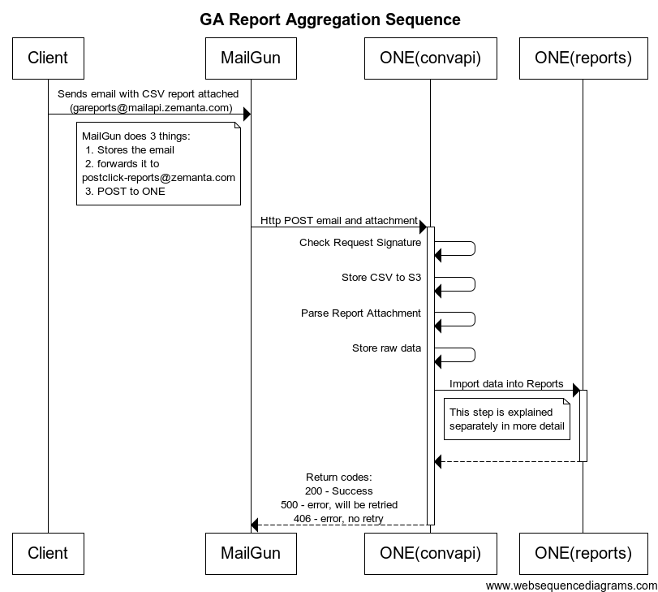

# Zemanta Eins

Nachfrageseite-Plattform (en: **Zemanta One** - A Demand Side Platform.)


## Code Organization

Code is organized in two units:
* server: contains all the server side code, that is database and API built with Django 1.7.
* client: a web application built with AngularJS 1.2.x. This client connect to server via API.

### Server

Server consists of the following Django apps:
* zemauth: custom authentication app which allows for authentication with an e-mail and Google. It defines its own User model which is used in the project instead of django.contrib.auth.models.User. When referencing it as a relationship in your own models, use settings.AUTH_USER_MODEL instead.
* dash: this app contains all the models and APIs for the dashboard.

### Client

Client is a web client built on top of AngularJS. It uses Server API to communicate with backend.

## How To Setup

### Server

#### Development databases

For development, you can use the development databases running on AWS.
Howto and connection details are specified in the [Z1 Staging Data repo](https://github.com/Zemanta/z1-staging-data/blob/master/README.md)

#### Local databases

In production, we use PostgreSQL 9.3 database so it is best to install it for development as well.

All the commands bellow assume that you are located in server subdirectory.

Create virtualenv and install requirements with pip:
```bash
pip install -r requirements.txt
```

You can also install development requirements with additional tools useful during development:
```bash
pip install -r requirements_dev.txt
```

Copy server/localsettings.py.temlate to server/localsettings.py and adjust them accordingly.

Create a database as specified in localsettings.py, eg. write something like this in postgresql shell:
```
CREATE USER user_name WITH ENCRYPTED PASSWORD 'password';
ALTER USER user_name CREATEDB;
CREATE DATABASE database_name;
GRANT ALL PRIVILEGES ON DATABASE database_name TO user_name;
```

Check /etc/postgresql/9.3/main/pg_hba.conf and change line "local all all peer" to "local all all md5".

Restart PostgreSQL:
```bash
sudo /etc/init.d/postgresql restart
```

Initialize database:
```bash
python manage.py migrate
```

Create an Amazon Redshift database and fill out the credentials in `localsettings.py` for your `STATS_DB_NAME` database. You can use credentials specified for [end-to-end tests](https://sites.google.com/a/zemanta.com/root/engineering/amazon-redshift-e2e-credentials) to login into Redshift (you can use `psql`) and create a new database and user which you will use for development. Passwords should be 8-64 characters in length and should contain one uppercase, one lowercase letter and one number, [more here](http://docs.aws.amazon.com/redshift/latest/dg/r_CREATE_USER.html).

```sql
CREATE USER user_name WITH PASSWORD 'password';
CREATE DATABASE database_name WITH OWNER user_name;
```

Apply the schema to the newly created Amazon Redshift database:
```bash
python manage.py redshift_migrate
```

There are Redshift unit tests but they aren't run automatically. You can run them with:

```bash
python manage.py test --redshift
```

### Setting up "eins" and "einsstatic" Docker containers on OSX

This setup is meant for designers to quickly setup development environment and start editing CSS and sending consequent LESS fixes on GitHub.

#### Docker installation

- Install [Docker Toolbox](https://docs.docker.com/mac/step_one/).

- Login to [Docker Hub](https://hub.docker.com/) (create account if needed):

```bash
docker login
```

- Run "Docker Quickstart Terminal" app. This will setup default VM in VirtualBox.

#### "eins" and "einsstatic" Docker containers setup

**NOTE: all of the following terminal commands should be executed from the zemanta-eins root directory.**

Make sure default VM is running and correct environmental variables are exported:

```bash
docker-machine start default
eval $(docker-machine env default)
```

Setup VirtualBox portforwarding:

```bash
VBoxManage controlvm default natpf1 "einsstatic,tcp,127.0.0.1,9999,,9999"
```

Above command will forward requests to http://localhost:9999 from host's port 9999 to default VM's port 9999. This is needed for serving static content.

Copy localsettings.py.circle-ci to localsettings.py:

```bash
cp server/server/localsettings.py.circle-ci server/server/localsettings.py
```

Edit DATABASES setting in **localsettings.py** to look similar to this: (and **insert actual connection details found on [Z1 Staging Data repo](https://github.com/Zemanta/z1-staging-data/blob/master/README.md).**)

```python
DATABASES = {
    'default': {
        'ENGINE': 'django.db.backends.postgresql_psycopg2',
        'NAME': '',
        'USER': '',
        'PASSWORD': '',
        'HOST': '',
        'PORT': 0
    },
    STATS_DB_NAME: {
        'ENGINE': 'django.db.backends.postgresql_psycopg2',
        'NAME': '',
        'USER': '',
        'PASSWORD': '',
        'HOST': '',
        'PORT': 0
    }
}
```

Run "eins" and "einsstatic" containers for the first time: (be patient, a lot of data has to be downloaded)

```bash
docker-compose -f docker-compose.yml.eins-einsstatic up -d
```

Now you can use the "Kitematic" app to start/stop "eins" and "einsstatic" containers. **Important: default VM needs to be running.** If not sure, run this:

```bash
docker-machine start default
eval $(docker-machine env default)
```

#### Accessing z1
To find the URL to access z1 from the host, run ```docker-machine ip```. Enter returned IP in your browser's address bar, followed by port number 8000 (e.g. http://192.168.99.100:8000/).

Now you have a functioning development environment. Static files are being watched and recompiled on changes automatically.


### Visualize models
```bash
python manage.py graph_models -a -g -o my_project_visualized.png
```

### Client

We use Grunt for building the app and Bower for management of third-party components. Third-party components are part of the repository and are to be committed while node modules used with Grunt are only develoment dependencies and are not to be committed.

All the commands bellow assume that you are located in client subdirectory.

Make sure that you have node.js, npm, bower, grunt and grunt-cli installed.

Install local development node modules:
```bash
npm install
bower install --dev
```

In case you are getting *protractor* related errors when deploying client you will need to install it as root.
```bash
npm install -g protractor
```

Now you have grunt and all the development dependencies installed so you can run grunt in order to build it:
```bash
grunt
```

Built client app will be placed in dist directory.

You can also run grunt watch to build it automatically while working on it:
```bash
grunt watch
```

For development, you can run grunt dev which also runs server on port 9999 and is reloaded after each change to source file:
```bash
grunt dev
```

## Testing

### Client

#### Unit testing

We use Jasmine as testing framework and Karma as test runner. Before running tests, make sure you have karma installed. Karma is integrated with Grunt, so tests can be run with:
```bash
grunt test
```

This will run tests in local Chrome browser.

Tests can also be run in SauceLabs cloud. First, copy the sauce.json template:
```bash
cp test/sauce.json.template test/sauce.json
```

and change it as needed. Then run:
```bash
grunt test --sauce
```

In this case tests are executed in 7 browsers, defined in test/karma.conf-sauce.js.

Karma can also auto-watch files and run test on every change:
```bash
karma start test/karma.conf.js
```

#### Testing databases

In the case you are using staging or other database for running Z1 locally running unit tests can become
very slow. You can provide additional entries in your DATABASES dictionary with prefix 'testing\_'. When
running tests these configuration entries will have the prefix 'testing\_' removed and will replace existing
entries in LOGGING setting.

And example config for using staging when running with ./manage.py runserver and local database for unit testing.

```python
DATABASES = {
	'default': {
		'ENGINE': 'django.db.backends.postgresql_psycopg2',
		'NAME': 'dev',
		'HOST': 'staging-host.com',
		'USER': 'staging',
		'PASSWORD': '...',
		'PORT': 5432
	},
	'testing_default': {
		'ENGINE': 'django.db.backends.postgresql_psycopg2',
		'NAME': 'z1',
		'USER': 'z1',
		'PASSWORD': '...',
		'PORT': 5440
	}
}
```

#### End-to-end testing

Integration testing is done using <a href="https://github.com/angular/protractor">Protractor</a>.

To setup, first copy the protractor.localconf.js template:
```bash
cp test/protractor.localconf.json.template test/protractor.localconf.json
```

and modify as needed.

Then set your Amazon Redshift testing credentials for the `STATS_E2E_DB_NAME` database in `server/localsettings.py`. Use the template from the `server/localsettings.py.circle-ci` file. The credentials
can be obtained here: [Amazon Redshift and E2E tests](https://sites.google.com/a/zemanta.com/root/engineering/amazon-redshift-e2e-credentials). These credentials can be the
same for CircleCI and local testing.

Then from project root run:
```bash
./run_e2e.sh
```
It will load the fixtures for you and run server and client applications.

The test suite will be run in your local Chrome browser.

##### Notes on Amazon Redshift and E2E tests

Each time when end-to-end tests are run, a new Amazon Redshift database with a random name is created. This way each e2e test suite run uses its own Amazon Redshift database. How it works:

The DATABASES dictionary should contain 2 entries for Redshift database connections:

 - `STATS_DB_NAME` - the database used for retrieving statistics
 - `STATS_E2E_DB_NAME` - the database used for creating random named `STATS_DB_NAME` databases for E2E tests.

1. `run_e2e.sh` generates a new database name and stores it in `E2E_REDDB` environmental variable.
2. `server/settings.py` updates the `STATS_DB_NAME` connection with the newly generated database name and access credentials. Access credentials are either taken from environmental variables `REDSHIFT_E2E_USER`, `REDSHIFT_E2E_PASS` and `REDSHIFT_E2E_HOST` (usually used for CircleCI runs), or from credentials set for the `STATS_E2E_DB_NAME` database connection in `server/localsettings.py` (usually used for local development).
3. `redshift_create_e2e_db` django command then connects with the `STATS_E2E_DB_NAME` connection and creates the database specified in `STATS_DB_NAME`.
4. `redshift_migrate` django command then applies schema migrations to the new database. Schema migration files are read from `reports/migrations/redshift/` directory.
5. E2E tests execute.
6. `redshift_cleanup_e2e_db` django command then drops the database that was created in the 3rd step.

##### Running tests on SauceLabs

You can also test on multiple browsers using SauceLabs cloud. To do this, first set up your sauce.json file as described in the Unit Testing section if you haven't done that yet.

Next, create a secure tunnel to the SauceLabs cloud by following the instructions at https://saucelabs.com/connect.

After you are done, you can run your tests using
```bash
grunt e2e --sauce
```

##### Google Analytics Postclick Data Import

Clients send us daily reports by landing pages from their Google Analytics. We import the postclick and conversion metrics into ONE's reports. The general process is described in the sequence diagram below



## Alerting

In the following section, we will review the most important metrics and responses to alerts, attached to them.

##### Demo Data
Demo is an important sales tool to convince clients to test or even buy our services. That is way it is important,
that data is refreshed.

[Is there recent data for demo?](https://metrics.librato.com/metrics/demo.total_recent_impressions?duration=604800)
[Has data refreshed successfully?](https://metrics.librato.com/metrics/reports.refresh_demo_data_successful?duration=604800)
[Were there errors during demo data refreshing?](https://metrics.librato.com/metrics/reports.refresh_demo_data_failed?duration=604800)

##### Tasks
Zemanta One keeps track of the actions, that need to be performed by Zemanta Zwei. These tasks constist of adjusting CPC bids, to daily budgets, and getting newest reports, etc. The important metric here is the number of failed tasks that occur through time.

[Number of failed manual tasks](https://metrics.librato.com/metrics/n_cmd_failed?duration=86400)

It's important that data and actions are in sync with external systems. This is why we need to track, how many hours passed from last sync. (If the delay is high, it could mean problems in backend (zwei) or error in payloads sent via eins)

[Last successful sync](https://metrics.librato.com/metrics/actionlog.hours_since_last_sync?duration=86400)

There is also an alert, which prevents for automatic action to stay in waiting state for more than 24 hours (from it's creation till the hourly sync)

[Oldest automatic action waiting](https://metrics.librato.com/metrics/actionlog.hours_oldest_auto_cmd_waiting)

Zemanta zwei has its own queue, filled with tasks from zemanta one. The queues should not get too full, since this means delay in reporting, which directly effects end user.

[Number of messages](https://metrics.librato.com/metrics/AWS.SQS.ApproximateNumberOfMessagesVisible?duration=10800)

##### Data consistency
We are aggregating lots of data (impressions, visits, conversions) via external systems. It is important, that what we aggregate and report to the end user consistently. Composite difference in preaggregation graph, shows the difference between aggregated and reported values. This means, that graphs should have the value of 0.

[Data consistency dashboard](https://metrics.librato.com/dashboards/46795)

##### New Relic
New Relic supports alerting based on APDEX (Apdex is an industry standard to measure users' satisfaction with the response time of an application or service) and ERROR RATE. Alerts are fired, when APDEX < 0.5
ERROR RATE > 13.6%

[New Relic](https://rpm.newrelic.com/accounts/719319/applications/4618367)


## Implementing fetures in DEMO

Demo consists of a group of decorators (`client/one/js/demo.js`), defaults (`client/one/js/constants/demo.js`) and services:
- HTTP get request cache (`client/one/js/services/zem_demo_cache_service.js`) - keys are server URL-s
- ad groups state object (`client/one/js/services/zem_demo_ad_groups_service.js`) - support for persistant ad group information
- sources state object (`client/one/js/services/zem_demo_sources_service.js`) - support for persistant content ad source list
- content ads state object (`client/one/js/services/zem_demo_content_ads_service.js`) - support for persistant contnt ad actions (pause, resume ... )

For most of the features cache is enough. For example:
- creating a campaign or updating an existing campaign: cache[`/api/campaigns/ID/settings/`] <- campaign_data

Media sources, ad groups and content ads are a bit more complicated because data needs to be propagated to many different client pages.
State objects apply changes to different tables. Example: content ads table shows enabled media sources for each ad - sources state object applies enabled and paused media sources to content content ads.

Each of these services has its api methods exposed and should be self-explanatory.

### API service decorators
First thing you want to do is to *fake/append to/change* a server request using cache and/or state objects.

Example: campaign list from accounts perspective
```js
$delegate.accountCampaignsTable.get = (function (backup) {
    return function demo() {
		return backup.apply(null, arguments).then(function (data) {
			data.is_sync_recent = true;
			angular.forEach(newCampaigns, function (_, campaignId) {
				var cached = zemDemoCacheService.get('/api/campaigns/' + campaignId + '/settings/');
				data.rows.push(defaults.campaignsTableRow(cached.settings.name, campaignId));
			});
			return data;
		});
	};
}($delegate.accountCampaignsTable.get));
```
Notes:
- only the decorator has to have a backup of the unmocked api method
- every mocked method is named *demo* because we wish to distinguish between mocked and original methods in tests

And to make this possible, we also need to completely mock the PUT requests:
```js
$delegate.accountCampaigns.create = function demo(id) {
    var deferred = $q.defer(),
        settings = defaults.newCampaignSettings(zemDemoCacheService.generateId('campaign')),
        campaign = angular.extend({}, {
            accountManagers: defaults.accountManagers,
            salesReps: defaults.accountManagers,
            history: [{
                changedBy: 'test.account@zemanta.si',
                changesText: 'Created settings',
                showOldSettings: false,
                datetime: (new Date()).toISOString()
            }], canArchive: false,  canRestore: false,
            settings: settings
        });
    newCampaigns[settings.id] = 1;
    demoInUse = true;
    zemDemoCacheService.set('/api/campaigns/' + settings.id + '/settings/', campaign);
    deferred.resolve(settings);
    return deferred.promise;
};
```

Because we want demo to work a little bit differently, there is some demo code hidden in controllers and other services. You can find it by greping for `$window.isDemo`.

### Pingdom transaction monitor

Always check if your changes affect demo transaction monitors. Be careful when changing demo defaults.
Current monitors:
- *demo campaign/adgroup management*: creating campaign, adgroup, uploading content ads
  - causes: errors in demo code
  - solution: run e2e tests again and find the bug in the code
- *demo defaults*: checking default ad group name, default media sources
  - causes: updated demo defaults
  - solution: check for changes in `client/one/js/constants/demo.js` and update the transaction monitor accordingly
- *demo navigation*: navigation with left sidebat and tabs between existing and created campaigns/adgroups
  - causes: production data changes
  - solution: update the transaction monitor with new demo campaigns and adgroups
If any monitor fails in the *first four steps*, there was a problem with login (usually database timeouts etc.).
