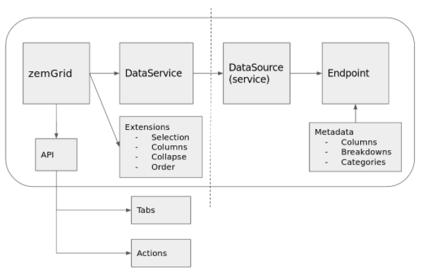

# Front-end architecture and guidelines

## Overview

Zemanta dashboard (Z1) provides an interface to account and campaign overview and management. The dashboard is a core part of the ever expanding Zemanta ecosystem. It is therefore essential to design the Zemanta dashboard in a way that supports scaling (feature and code base scaling) and provide guidelines to keep the code base clean and maintainable. This documented is intended to provide these development guidelines for **Zemanta dashboard web client** (hereinafter dashboard, app or Z1) and to briefly explain dashboard's architecture in order to make onboarding of new developers easier and quicker.


## Component-based architecture overview

Component-based architecture focuses on the decomposition of the design into individual functional or logical components that represent well-defined communication interfaces containing methods, events, and properties. It provides a higher level of abstraction and divides the problem into sub-problems, each associated with component partitions.

The primary objective of component-based architecture is to ensure component reusability. A component encapsulates functionality and behaviors of a software element into a reusable unit.


We migrated our dashboard to component based architecture in order to provide a good foundation for further app development and scaling with as little problems big applications face as possible:

- Poor reusability - duplicated code when writing similar controllers and templates.
- No clear relationship between controllers and views/ templates.
- Data flow is hard to understand and control due to prototypal inheritance. Any child controller can access/ mutate data from its parent via `$scope`.
- More complicated controllers became too large and hard to maintain. Simply splitting a large controller into smaller ones doesn't solve the underlying problem of controllers doing too many things at once.
- Large HTML templates that are hard to understand and maintain.
- Writing good tests becomes hard/ impossible to do.

There is a large number of benefits to leverage from component-based architecture approach:

- Reusable components - instead of reimplementing similar things, this approach enables component reuse and composition.
- More manageable (one-way) data flow.
- Isolated component scopes - only pass a component the data that it needs to behave as expected (via one-way data bindings).
- Distinguishing between components that simply render data (presentational components) and components that keep a certain state or operate on the given data (container components).
- Testable components.

More resources:

- [Component-Based Architecture](https://www.tutorialspoint.com/software_architecture_design/component_based_architecture.htm)
- [Presentational and Container Components](https://medium.com/@dan_abramov/smart-and-dumb-components-7ca2f9a7c7d0)
- [Refactoring Angular Apps to Component Style](http://teropa.info/blog/2015/10/18/refactoring-angular-apps-to-components.html#toward-smart-and-dumb-components)
- [How I've Improved My Angular Apps by Banning ng-controller](http://teropa.info/blog/2014/10/24/how-ive-improved-my-angular-apps-by-banning-ng-controller.html)


## Zemanta dashboard overview

### Routing and views (pages)

Views module defines main dashboard pages (each page is a container component). View component functions as an orchestration layer for the widgets used on the page.

**Routing:**
- URL structure: `(/v2)/<view>/<entity>/<id>/<additional params>`
- `app.routes.js` - basic app routing configuration
- `app.redirects.js`- legacy redirects
- `views.routes.js` - routes definitions - mappings between routes and controllers/ templates
    - Main view: state activation hooks, redirects, permission checks etc.
    - Views: analytics, campaign-launcher, pixels, publisher-groups, scheduled-reports etc.


### Styles

- Follow BEM convention [Docs](https://en.bem.info/methodology/).
- Separate styles based on purpose.
- Each widget component should be styled internally - namespaced class names. 

### Patterns

#### State services

Widgets' internal state is managed via state services. State service is a *store* which consists of the current state object and actions/ methods to manipulate the current state. State management via state services was heavily inspired by Redux state management pattern. Its main idea is an unidirectional data flow which makes it easier to keep the state synchronized between different components/ widgets by providing a single source of truth.

##### Example state service

State service used by dashboards' widgets usually looks like this:

```js
angular.module('one.widgets').service('zemExampleWidgetStateService', function () {
    function zemExampleWidgetStateService () {
        var state = {
            exampleProperty: null,
        };

        this.getState = getState;
        this.updateExampleProperty = updateExampleProperty;

        function getState () {
            return state;
        }

        function updateExampleProperty (newValue) {
            state.exampleProperty = newValue;
        }
    }

    return {
        createInstance: function () {
            return new zemExampleWidgetStateService();
        }
    };
});
```

Widgets create an instance of state service and get a reference to the state object when they are initialized:

```js
angular.module('one.widgets').component('zemExampleWidget', {
    ...
    controller: function (zemExampleWidgetStateService) {
        var $ctrl = this;

        $ctrl.$onInit = function () {
            $ctrl.stateService = zemExampleWidgetStateService.createInstance();
            $ctrl.state = $ctrl.stateService.getState();
        };
    },
});
```

Rendered state in widget's template is automatically updated when `$ctrl.state` is updated by state service. For this to happen, template must reference state object in its bindings:

```html
<div class="example-property-output">{{$ctrl.state.exampleProperty}}</div>
```

Widget can update the state by calling state service's actions:

```js
$ctrl.stateService.updateExampleProperty('new value');
```

Widget can also pass instantiated state service to its child components via property bindings in its template. Child components can then use the state service to get access to state object and to trigger state updates the same way parent component does.

Testing state services is quite simple. All dependencies (usually just the endpoint service) are easily mocked. The tests are then nothing more than initializing a mocked state, calling an action and asserting the action updated the state correctly:

```js
describe('zemExampleWidgetStateService', function () {
    var zemExampleWidgetStateService;

    beforeEach(module('one'));
    beforeEach(inject(function ($injector) {
        zemExampleWidgetStateService = $injector.get('zemExampleWidgetStateService');
    }));

    it('should correctly update example property', function () {
        var stateService = zemExampleWidgetStateService.createInstance();
        var state = stateService.getState();

        state.exampleProperty = 'value';

        stateService.updateExampleProperty('new value');
        expect(stateService.getState().exampleProperty).toEqual('new value');
    });
});
```

### Directory structure

Below is a app's directory structure that follows best practices for Angular development and component based architectures (with some modifications to better fit our needs).

```js
client/
    lib/
        components/                                        // bower packages
    one/
        app/
            common/                                        // common building blocks, not Z1 domain specific - can be extracted into external libraries
                components/                                // common components used by different widgets - mimic widget's directory structure
                directives/                                // common directives used by different widgets
                filters/                                   // common filters used by different widgets
                services/                                  // common services used by different core services and widgets
            libs/
                libs.module.js                             // merge all vendor libs into one angular module used when importing
            services/                                      // core services - shared by different services and widgets
                example-core-service/
                    zemExampleCoreService.endpoint.js
                    zemExampleCoreService.endpoint.spec.js
                    zemExampleCoreService.service.js
                    zemExampleCoreService.service.spec.js
            styles/
                one/                                       // main Z1 styles
                example-whitelabel/                        // whitelabel specific style overrides
            test/                                          // test helpers and mocks
            views/
                example/
                    zemExampleView.partial.html
                    zemExampleView.controller.js
                main/
                    zemMainView.controller.js              // pre-state change hooks - permission checks, redirects etc.
                    zemMainView.partial.html               // main app's container with header, content, footer, drawer etc.
                views.routes.js                            // route definitions
            widgets/                                       // app's main container components
                zem-example-widget/
                    components/                            // widget's (preferable stateless) sub-components
                        zem-sub-component/                 // mimic widget's directory structure
                    zemExampleWidget.component.html
                    zemExampleWidget.component.js
                    zemExampleWidget.component.less
                    zemExampleWidget.component.spec.js
                    zemExampleWidget.endpoint.js
                    zemExampleWidget.endpoint.spec.js
                    zemExampleWidget.state.js
                    zemExampleWidget.state.spec.js
        assets/                                            // example CSVs, tutorial PDFs
        images/                                            // app's icons and other image assets
            whitelabel/                                    // image overrides used in whitelabel designs
```

### Build system (Webpack)

Commands:

```sh
npm run dev                     # run development server serving static files
npm run tests                   # run front-end tests
npm run tests-watch             # run front-end tests in watch mode
npm run lint                    # run front-end linters
npm run prod --build_number=123 # build production ready static files
```

### Core services
 
Services used globally throughout the app providing core business logic. They are implemented using pub-sub pattern (register listener, notify listeners) and normally hold a state, which can be changed only via the service itself. Interested components can register to be notified about the changes (a change can be triggered by other components or by the server - push). 

**Core service** (stateful) holds a state and is responsible for state propagation and persistence (via local storage, rest api, URL etc.). Service decides how, when and where to store the state and what (if anything) to hold in memory. 

**Non-core service** (stateless) is usually used internally by only one widget/ component and it should be located in widget's subdirectory. Another example of non-core services are common services, which provide some general functionality (e.g. utils) and should be defined in `one.common` module.

#### Z1 core services

- **Entity service(s)**: `zemEntity.service.js`
    - Usage:
        - All components accessing entity data, settings and actions available on entities and subscriptions to these entity changes.
    - Provides:
        - Access to entity data, settings (account, campaign etc.) and actions:
            - `zemEntity.service.js`: Helper for manipulating entities and executing actions. It provides standard methods (get/update/create) and actions (bulk) that are bridged to specific entity service.
            - Entity specific service - e.g. `zemAccount.service.js`: Normally not used externally, all actions available through `zemEntity.service.js`
    - Internal:
        - Entity instance service - CRUD operations `zemEntityInstance.service.js`
        - Entity actions - instance and bulk domain specific actions `zemEntityAction.service.js`
    - Current state:
        - Acts like a bridge to REST API with limited local cache (names, states). Since all entities are updated through this service, it knows when to update internal cache and notify listeners.
    - Future plans:
        - Convert service to a Redux store.
- **Navigation service**:
    - Usage:
        - Entity navigation and hierarchy retrieval.
    - Tech debt:
        - Wrapper around legacy navigation service. Data retrieval and cache should be moved to entity services.
- **Initialization service**:
    - Usage:
        - Initialize core services on app's initialization.
- **User and Permission services**: `zemUser.service.js`, `zemPermissions.service.js`
    - Usage:
        - Permission checks, user data retrieval and manipulation.
    - Provides:
        - Access to all user data, permissions, etc.
- **FilterService**: `zemDataFilter.service.js`
    - Usage:
        - Used by components showing metrics data - chart, grid, infobox (components depending on selected filters and date-range).
    - Provides:
        - App-wide filter state management: date range, source, agency, account type, publisher status, entity status
        - An interface to configure filters and subscribe to filter changes.
    - State is persisted through URL query params.
- **Other services**:
    - Local storage.
    - Agency service: agencies retrieval and cache.
    - Alerts and toasts service: messaging system.
        - Alerts are retrieved from back-end based on entity.
        - Toasts are dynamically created by different widgets/ components.
    - Media sources: media sources retrieval and cache.
    - Full-story and GA initialization services.
    - Selection service: currently used for communications between grid and chart about entities user selected in grid.

### Components overview

#### Grid



**Functionalities**
 - Extendable cells - links, numbers, titles, images, etc.
 - Grouping --> n-levels of breakdowns
 - Infinite scrolling (load more...) with virtual scroll    
 - Pivot columns & Fixed/Sticky header and footer
 - User interactions - copy, edit, collapse, select, goto, etc.
 
**Main components**

**zemGrid** component is one of the most advanced components in the zOne applciation.  
In short, it is a complex table used for displaying various formats (numbers, images,
user controlls, etc.) and providing advanace user interactions (grouping, scrolling, modifying).
zemGrid itself is completly isolated (almost) from zOne core and is configurabile through 
metadata provided by the Endpoint service. For advance manipulation it provides API, which can be used for
modifying content. retrieving current state (pull & push) or extending functionality.

**DataSource** provides incremental access to data; through continous retrieval. Internally 
data is stored in a data/breakdown tree, where nodes on the same level corresponds to 
the data breakdown level (Campaigns -> By Source -> By Country -> By day). DataSource 
besides fetching also provides patching; modify request returns a patch, that can be applied to a tree (e.g. modifying one number (cell - row id/column) can affect also other cells (rows and columns); e.g. modifying daily budget can change daily budgets and bids on different sources. 

Data is fetched using Endpoint, which provides access to server based on the configured meta data (entity id, level, breakdown; adgroup 11 - Sources - Country -> By Day). It provides GET and POST/PATCH functions.
Endpoint Metadata provides definitions and rules for columns and breakdowns (names&description, formatting information, availability,  ...)

**DataService** provides data acess to internal Grid components through DataSource. It is responsible to notify
listners regarding data changes, formating data tree into 2-dimensional data stucture along with formating
data based on the meta information etc. It is separated from DtaSource to provide cleaner separation between
presentation and data layer; datasource or endpoint can be replaced with another one without any effect on the
representational components.

Extensions; zemGrid is designed in a way to allow clean and isolated integrations of new UX functionalties. Using API it is possible to access, modify and observe (pubsub) entire zemGrid state. Current extensions: Selection, Columns, Collapse & Order. On the other hand API can also be used externally, to provide 
business specific actions: bulk actions based on selection, columns & breakdown chooser, etc.
 
 
#### Settings

```
<zem-side-panel>
    <zem-settings>
        <zem-settings-container> (1..n)
            <specific-settigns-widgtets> (1..n)
```


### Next steps

- Migrate Bower packages to NPM
- Remove LESS imports hack (performance hit)
- Use One modules for discovery (not <some>.webpack.js)
- import / required libraries/ globals - angular, moment, constants, options

### Migration plan (reactive design using Angular/ Vue/ React)

TODO


