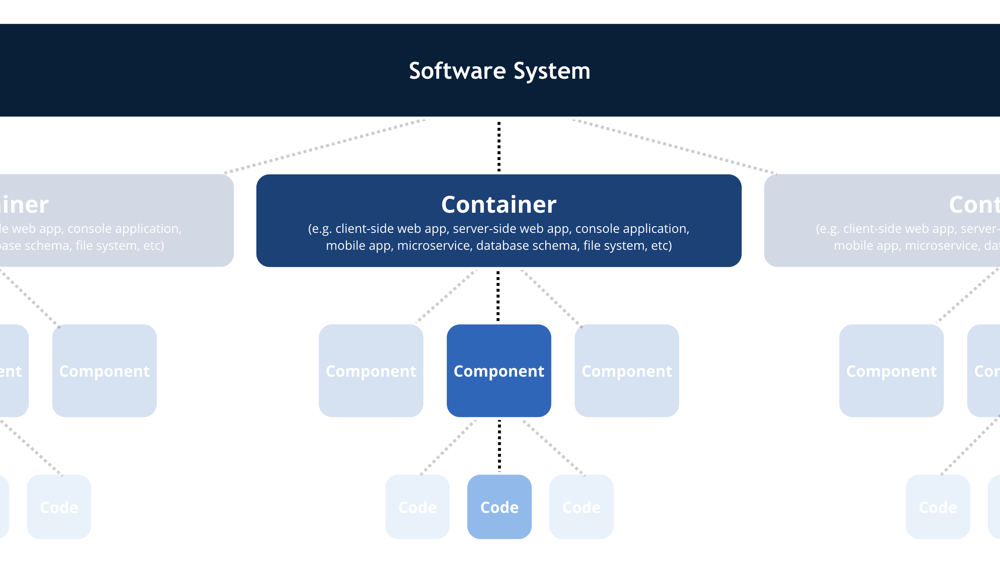
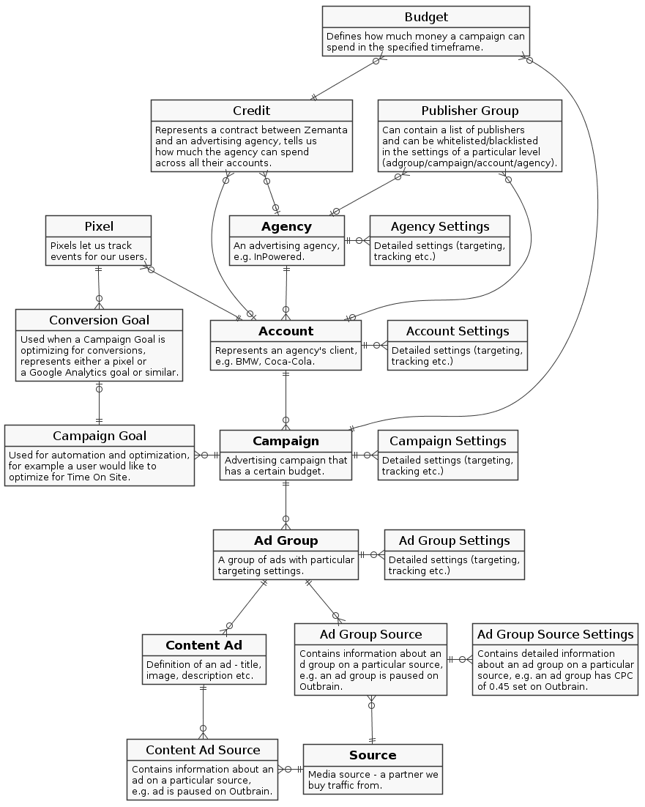

# Architecture

The following diagrams are constructed according to the [C4 Model](http://c4model.com).

The C4 model approach is to present the big picture first and then zoom in on individual pieces.

## System Context

## Z1 Container

## Z1 Components

## Entity-Relation diagram

