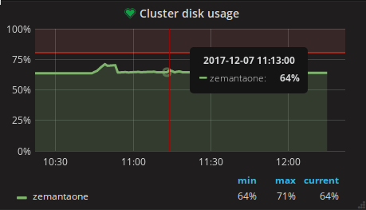
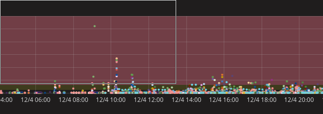
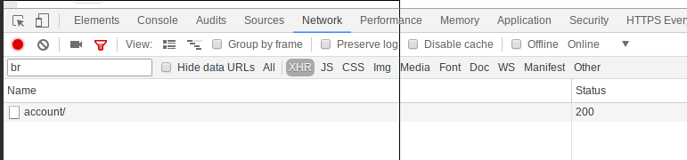

Architecture overview
=====================

source:
https://docs.google.com/document/d/1vpOXBERk-ocahCCBrs3otecNfJUpZYBUjDl8G-54IS8/edit

Data for reports and breakdowns comes from **RDS** and from
**Redshift**. Both of these databases have a designated frontend, namely
**Dash API** and **Redshift API**. These APIs job is to query their
databases and return results in standardised fashion.

Above them stands the **Stats** module, that coordinates these APIs and
joins their data.

Additional module **ETL** is there to prepare data in such a way that is
most efficient for Redshift API to query.

Entry points into the system are located in **Stats** for when we need
data from both databases, and in **Redshift API** for when we only need
data located in Redshift.

Stats
-----

-   Entry points: **api\_\*.py**

<!-- -->

-   Build constraints for APIs (simple dicts with ids), the idea is that
    everything is filtered by filters and user permissions **at this
    point** and only ids that pass the filters are forwarded onward to
    other APIs. Other APIs should not care whether a row or a field
    belongs to results, they rely on that constraints were
    already prefiltered.

<!-- -->

-   Coordinate RSAPI and DashAPI queries (based on order)

<!-- -->

-   JOIN redshift and dash API data after they return results

-   Filter columns by permission (**permission\_filter**) - remove
    columns that user has no permission for

-   Some augmentation - currently augmentation of redshift data is
    happening here - this should be moved to Redshift API as each of
    these APIs should return complete data. The only augmentation
    happening here should be the one that needs data from both APIs.

Dash API
--------

-   Entry points: **api\_\*.py**

<!-- -->

-   (efficiently) load data from RDS

-   Data loading is happening in **loaders.py**, an instance of loader
    acts as a per entity per request cache. Make sure queries
    are optimized. To help with access dicts are built.

-   Loaders hold the data, augmenter makes from from data in loaders.

-   There was one case where data was loaded based
    on whether user has the right permission. This goes against the
    way the module is designed - it should load all data, if there is
    performance issue, the performance issue should be resolved and
    not avoided. Columns filtering based on user permissions should be
    applied at Stats level.

Redshift API
------------

-   Entry points: **api\_\*.py**

<!-- -->

-   (efficiently) load data from Redshift

Some concepts:

-   Base view: view derived from **mv\_master**

-   Yesterday view: view derived from **mv\_master**, limited to
    **yesterdays date**

-   Conversions view: view derived from **mv\_conversions** (GA data)

-   Touchpoints view: view derived from
    **mv\_touchpointconversions** (pixels)

### 2 ways to query

-   **Joint query**: *1 SQL query.* Base, yesterday, conversions view
    and touchpoints view are all joined, ordered and paginated within
    the 1 query. This approach is used when the combination of the
    breakdown would simply need to load too much data into python to
    make the proper order, pagination and join. For example querying
    breakdown campaign, ad group, dma (this is account view). This can
    take like 10x10x400 rows and if these are all loaded into python
    it takes a lot of memory. This kind of queries are still slow,
    faster then load all for large breakdowns though. This is due to
    uniquness of the queries - touchpoints query is translated from
    rows to columns and that means that each of the queries is quite
    unique and that brings in the awful compilation time at almost
    every request.\
    It might be that this query can be deprecated in the future, this
    needs to be compared again with query all and evaluated. A lot has
    changed since I was last comparing the speeds.

-   **Query all**: base, yesterday, conversions and touchpoint views are
    all queried separately and in parallel. All data is loaded into
    python and only after that joined, ordered and paginated. This
    query is suitable when we know memory will not be an issue. For
    example 1 or 2 levels (except publishers) is usually suitable
    for this. Also when we include date dimension this query is
    suitable because we can paginate with the WHERE clause instead of
    offset and limit.

### Templates

Redshift API builds SQL from templates. It is using our **BackToSQL**
library that makes this easier.

How this works:

-   We have a query template, eg *breakdowns.sql*

-   In queries.py and models.py we select the context for this template,
    namely:

    -   Which dimensions (breakdowns) to query- *dimensions column
        templates*

    -   Which agregates - *aggregates column templates*

    -   From what table (view\_selector) - name of the table

    -   What are the constraints, group by and order

Columns are also templates. A column definition consists of a template,
alias and template context. For example:

clicks\_sum = backtosql.TemplateColumn('part\_sum.sql', {'column\_name':
'clicks'}, AGGREGATE)

*Part\_sum.sql:*

SUM({{ p }}{{ column\_name }}) {{ alias }}

*column\_name* and *alias* are passed when column is defined. Alias can
be set with an ***alias* kwarg**, or if this is done as a model
attribute alias is set automatically to **model attribute name.**

*p* is column prefix that is put into context when columns are
generated. It means *prefix*. SUM(base\_table.clicks)...

TemplateColumn also has an optional parameter **group**. This can be any
value, it is used as a way to group columns together. We often use
“BREAKDOWNS” and “AGGREGATES” groups as they are selected and used in a
different manner.

Convention:

-   Column template names: \`part\_\*.sql\`

#### BackToSQL

This is an internal library written specially for our use case. Its core
function is to define **fields** and reference them in query templates.
This way field definitions don’t need to be repeated between templates
and query structure is more clearly visible.

A field is also a template.

SELECT { columns| column\_as\_alias } FROM a NATURAL JOIN b ON some\_id
WHERE {constraints|generate} GROUP BY { breakdown\_columns| only\_alias
} ORDER BY some\_id DESC;

Conventions:

-   Dont nest templates (easier to work with this way, if deeply nested
    hard to make light adjustments)

##### Future

I had a plan to publish it on PyPI but haven’t had time to do it. The
goal would be to separate it from the z1 project, publish to PyPI and
then add it as a requirement to z1.

### View selection

To make queries efficient we have a set of **derived views** that are
tailored for a few most often used breakdown combinations. This means
that they only contain dimensions that are needed for the breakdown and
their distribution key is set to fit views that are joined together in 1
query.

To make them we use master table definitions as kind of templates where
we parse out dimension and stats columns and then combine only needed
ones. Master table definitions are the following:

-   etl/migrations/redshift/mv\_master.sql

-   mv\_conversions.sql

-   mv\_touchpointconversions.sql

-   Mv\_publishers\_master.sql

You will see this kind of rows in the above files. This is used to parse
these definitions and so that subsets can be prepared.

-- kw::dimensions

-- kw::aggregates

-- kw::end

What matters for a derived view:

-   What dimensions need to be **collocated** (joins, group bys)

-   What dimensions are filtered for (constraints)

-   Size of tables (less dimensions -&gt; less rows)

When doing joins and group bys data collocation on nodes is important (I
talk more about it here
[*https://zemanta.github.io/2017/03/13/first-steps-with-amazon-redshift/*](https://zemanta.github.io/2017/03/13/first-steps-with-amazon-redshift/))
for performance. For example when grouping by ad group, if data from the
same ad group is not on the same node it needs to be transferred to
leader node from all the nodes that contain rows with this ad group.
This means network traffic, no concurency of the query (all needs to
happen on leader node instead of other nodes working in parallel). This
is why materialized views have distirbution key set.

To make filtering effective we also make sure sort keys are set
properly. We use compound sort keys and its order is important. If sort
key is date-account-campaign-adgroup and our filter consists of date,
campaign and ad group this sort key won’t help much because all accounts
will still need to be scanned to find the right campaigns.

You will notice that sort key always follows the same pattern:

1.  Date (always in constraint)

2.  Source (always in constraint - filter all adds all ids - this is
    important, don’t remove it, see previous paragraph)

3.  Entity ads hierarhically (account, campaign, ad group …)

As already said - sort keys work best if all are used. If for example we
don’t use filter by source\_Id, keys following are not so efficient.

You will notice when it comes to delivery breakdowns that not all
derived views are efficient. For example delivery device sort key is
\*hierrarchy\*, device\_type, device\_os and device\_type is not
constrained when device\_os is queried. This sort key is not optimal,
but the device\_os view was not used much so in this case it at least
gets some performance from smaller table. Too much combinations.

How to add new views:
[*https://github.com/Zemanta/zemanta-eins/pull/2653/files*](https://github.com/Zemanta/zemanta-eins/pull/2653/files)

Geo:

Date-source-account-campaign-country-state-dma

Better:

Date-source-account-campaign-country

Date-source-account-campaign-state

Date-source-account-campaign-dma

### Caching

Every SQL including parametrs TEXT is hashed and that is cache key. It
gets invalidated every refresh\_k1 run.

ETL
---

ETL mean Extract Transform Load. This is basically what we refer to when
we mention “materialization”. The point of this project is that it
prepares data for Redshift API so that it can be queried

The process goes something like this (see etl/refresh\_k1.py)

1.  Insert daily statements and get spend factors (spend factors are
    used to calculate effective spend - spend without overspend)

2.  Start preparing helper tables that will be used to make data for the
    main table, mv\_master:

3.  MVHelpersSource (source\_id, slug mapping)

4.  AdGroupStructure - ad group id, campaign\_id, account\_id mapping

5.  CampaignFactors - spend factors caluclated in the daily statements
    step are written to the database here

6.  Normalized stats - temporary table where cleaned data from stats is
    put, this is the basis for mv\_master

7.  Touchpointconversions

8.  MV\_master (joins data from most of the previous tables)

9.  …

The whole fow can be seen in **refresh\_k1.MATERIALIZED\_VIEWS** list.

Design decisions
================

**Parents** parameter for breakdowns: Because a breakdowns in user
interface are put together with multiple requests

Notes
-----

Pretty print SQL:

print backtosql.clean\_sql(cursor.mogrify(sql, params))

(processor intesive, slow)

Maintenance
===========

The dashboard
-------------

[*https://marty.zemanta.com:3000/dashboard/db/z1-etl*](https://marty.zemanta.com:3000/dashboard/db/z1-etl)

I usually check:

-   Cluster disk usage

-   Did refresh\_k1 run? After a red bar a green bar should follow or
    cover it - it means that it started (red) and finished (green). If
    it didn’t that means that data in z1 is stale

-   How long does materialization last - this is just for info, if it is
    more than 1 hour that means that every second refresh\_k1 will
    fail because only 1 will run simultaneously if its executed by
    cron

-   Extra reprocessing days: sometimes, very rarely, it happens that
    some old campaigns are restored from the archive and that
    campaigns have some unprocessed daily statements. In such cases
    daily statements reprocessing will see on what dates this daily
    statements are and then the whole reprocess will be run from that
    date on.

-   Query time breakdown - this is chart that shows how long do RS
    queries take. I usually check whether any queries are executing
    and it can be seen if they are waiting for something.

Redshift admin access
---------------------

Some operations on the cluster can only be done with admin access. For
example access to stl\_load\_errors table, query disk space by table
etc.

User: eins

Password: ask nejc

Cluster disk usage
------------------

Possible reasons:

- hanged queries (find and kill query in AWS console, search for long
running ones)

- vacuum running too long (kill query in AWS console)

- somebody forgot to delete huge temporary tables (delete the table).

- supply\_stats is huge -

If cluster contains only the data we need you can try to negotiate with
product and andraz that old rows are removed from the supply\_stats
table.

If even that is unsuccessful then cluster resize is needed. Mind that
this will cause some downtime - in the range of 2 hours.

There is a django command that should be run in runssh that will output
**disk space usage by individual table**

-   ./manage.py report\_cluster\_info --interactive

{width="4.78125in" height="2.7395833333333335in"}

Those **bumps** are normal - when materialization is running temporary
tables are created that take some space, vacuum also takes some
additional space when running.

Cluster switch
--------------

Reasons to change size of a cluster:

-   Disk usage getting to high and can’t find any empty space

-   Need more performance (in my tests - done 1 year ago - a 2 times
    bigger cluster brought 33% improvement on speed. Of course it
    matters a lot how tables and queries are designed)

-   It is too expensive or is getting replaced by something else, reduce
    size

The easy way is that you go to AWS console and change cluster settings
and save. Mind that this will cause a couple of hours of **downtime**.
This might be something we want to avoid.

### How to do that without downtime

Official guide:
[*https://docs.aws.amazon.com/redshift/latest/mgmt/rs-resize-tutorial.html*](https://docs.aws.amazon.com/redshift/latest/mgmt/rs-resize-tutorial.html)

My guide, similar, but some specifics (use the official guide to see
what buttons to press):

To avoid downtime we will create a new cluster that will replace the old
one.

-   Create snapshot of the existing cluster, we will name this the
    **old cluster.** All systems (z1, k1…) point here, this is the
    production cluster.

-   Create a new cluster based on the snapshot, this will be our **new
    cluster**. Some settings are not copied, like cluster security
    group, so make sure you select the right ones (open edit for old
    cluster to see what parameters are set)

-   At this point new cluster will have the same configuration as the
    old one. Resize it and take a lunch break, as this can take
    a while.

-   Resize done, now you have 2 working clusters, but the problem is
    that in the meantime new data was written to the old one. So that
    data needs to copied over. Use UNLOAD and COPY commands to save
    new data to s3 and then copy it to the new cluster. I deleted all
    todays data in the *new* cluster and then transfered all todays
    data to it. Copy data from tables: conversions, stats,
    supply\_stats, … mv\_\* tables don’t need to be copied as they
    will be populated by materialization

-   DO THIS FAST: rename the old cluster to something else and rename
    the new cluster to old clusters previous name. Now the new cluster
    is in production

-   WARNING: When transferring data to the new cluster and if
    materialization hasn’t been run until the new cluster was put into
    production it will happen that mv\_\* tables will have old data
    until materialization finishes. This can be a problem for
    campaign\_stop, daily reports by email and autopilot. Make sure
    that you have up to date data in the new cluster when these are
    run, or temporarily disable them and run them manually. It
    happened that reports with old data were sent and in that case
    Ziga resent them with an appology to our clients.

### Future

-   This copying data from old to new cluster is PITA. Nejc suggested
    that in time of migration we write data to both clusters - set 2
    DBs in K1 settings. The problem will still exist, but the gaps
    will be smaller (while resizing and restoring snapshot no data can
    be written)

### A note on big HDD vs small SSD redshift nodes:

-   I compared them when I was choosing the best configuration for our
    latest cluster size. It turned our that the big HDD cluster was a
    bit faster in like 90% of queries. It was faster for a few
    milliseconds, but the thing is that those queries were in the
    range of 1-2s already. In my opinion those speeds did not need
    that improvement, the deciding factor why I chose the SSD nodes is
    the 10% of the queries that were slow (like 30s slow). SSD cluster
    was a lot faster for those and for queries that were
    not optimized. So that is why this cluster won. The trello ticket
    that has some info:
    [*https://trello.com/c/RzPsFepj*](https://trello.com/c/RzPsFepj)

Vacuuming and analyzing
-----------------------

It is important that you vacuum and analyze your tables after some large
chunks of data was deleted, inserted or updated. Vacuum will make sure
deleted rows are really deleted and do not take up space anymore. It
will also resort the table based on the sort key.

Analyze will update table statistics that are used by query planner when
it is designing query plans.

Creating table with admin
-------------------------

The user you create a table with is the owner of the table. Depending
how user rights are set, this can be a problem if the owner is not
compatible with what owner our systems use.

alter table mv\_account owner to eins2;

Maintenance window
------------------

Monday morning is redshift cluster maintenance time (check AWS console
where this can be changed). Because of this the query execution plans
cache is dropped (all queries need to be recompiled) and until this
cache is repopulated expect some slowdown on queries.

{width="6.5in" height="2.3055555555555554in"}

Notice the increased query time 12/4 8:00 - this is when users came and
started using the dashboard and the query compilation cache was cold.

The 'stl\_load\_errors' error
-----------------------------

Check the stl\_load\_errors table. You need to be **admin** user
otherwise you see only errors from your current user. Example error:
[*https://sentry.io/zemanta/konsistency-one/issues/322603045/activity/*](https://sentry.io/zemanta/konsistency-one/issues/322603045/activity/)

It usually has something to do with the followng:

-   Either value is longer than a varchar, int column can take

-   Or has to do something with CSV, unescaped quotes, too many values

You will see which column, which file, what row is problematic and the
error message:

userid | 106\
slice | 17\
tbl | 309870\
starttime | 2017-11-29 13:27:23.765334\
session | 29996\
query | 1517111\
filename | s3://k1-reports/reports/b1-audience/2017/11/27/part-00001.gz\
line\_number | 65408\
colname | media\_source\
type | varchar\
col\_length | 127\
position | 37\
raw\_line | 5547fc4f-d3c1-11e7-9060-e4c325a9a790 kFhgfWLk1sSljdgMtCMk
aaaa"zzzz 96 229 836 51550 2017-11-27T22:21:37Z 2017-11-27T22:21:37Z 2
Win7 Firefox RU MOW Moscow 0 180\
raw\_field\_value | aaaa\
err\_code | 1214\
err\_reason | Invalid quote formatting for CSV

A good practise is that you add quotes around values in CSV that you are
going to import. **ADDQUOTES** parameter for UNLOAD and then
**REMOVEQUOTES** for COPY.

Redshift queries are slow
-------------------------

Check the following:

-   Any queries hang or is taking all the resources (best seen on AWS
    console)?

-   There can be a lot of queries at once (API users) (check count
    redshift queries chart)

-   Non optimized tables and/or queries (check sort keys, dist keys,
    WHERE, GROUP BY, JOIN etc. Read about this in my blog post)

-   Last resort: query plan

Common SQL mistakes
-------------------

**Arithmetics with NULL**: 5 + NULL = NULL. SUM(NULL) = NULL. Use
COALESCE (or its alias NVL) to provide alternative value. Eg:
SUM(clicks) + SUM(impressions) when all clicks are NULL will result in
NULL -&gt; SUM(NULL) + SUM(impressions) = NULL. The right way:
NVL(SUM(NULL), 0) + NVL(SUM(impressions), 0) = ...

Changing table definition
-------------------------

Lets say you want to change sort key, dist key, add new columns, remove
column, update a lot of values, or vacuum taking too long? You need to
create a new table, copy data over, and switch names. Eg lets change
definition of mv\_master.

CREATE TABLE mv\_master\_new …

ALTER TABLE OWNER TO eins2;

INSERT INTO mv\_master\_new FROM (SELECT … FROM mv\_master …); -- this
can take awhile (1-2 hours for example for stats table)

BEGIN; -- do this in transaction

ALTER TABLE mv\_master RENAME tO mv\_master\_old;

ALTER TABLE mv\_master RENAME TO mv\_master;

COMMIT;

Somethimes when inserting into a new table sorting takes too much space
and time. In that case insert by smaller date range. I for example
copied stats, mv\_master by a few months at a time.

Also update the table definition file in **migrations** folder.

NOTE: If adding a new columns and it is OK that this column is in the
last place, no data need to be inserted for this column then it is OK if
you just ALTER TABLE ADD COLUMN instead of the whole process.

It is a general rule if you have a big table and it needs to be vacuumed
and more than 20% rows are unsorted it is best to just copy it into a
new table.

Adding columns
--------------

Adding new fields that are calculated from data we already have? Add
column definition and template to models in redshift api.

Need to add new dimensions? Eg. device\_type to conversions? Then you
need to:

-   Change mv\_conversions table definition

-   Write how this data is inserted into mv\_conversions (ETL), data
    cleanup

-   Define column on Conversions model in Redshift API, put it into the
    right group

-   Make sure this column is allowed to be returned to
    user (permission\_filter)

See it here
[*https://github.com/Zemanta/zemanta-eins/pull/2644*](https://github.com/Zemanta/zemanta-eins/pull/2644)

Why do this: UPDATE is very slow in redshfit

Future
======

Standalone reporting service
----------------------------

I had a plan to separate reporting modules out to a separate service
that would be queriable via api. Think as RedshiftAPI, Stats, DashAPI,
ETL would be a separate service.

Regarding Dash API my idea was to have a copy of RDS data in a separate
database that would be easy to query. When something would change in
eins it would notify reporting service (same as k1 pings) and it would
sync the data it needs to its own database.

The student chalange 2017 has an assignment that was meant as a resarch
on what databases we could use for such a service.

Backtosql
---------

The plan is to separate this package from eins and offer it on PyPI. It
was written as a completelly separate django app, so it can be neately
separated out. What is missing is a setup.py and it can be trasfered to
an independent repo.

Other

[*https://github.com/Zemanta/zemanta-eins/pull/2644*](https://github.com/Zemanta/zemanta-eins/pull/2644)

[*https://github.com/Zemanta/zemanta-eins/pull/2653*](https://github.com/Zemanta/zemanta-eins/pull/2653)

Find breakdowns request:

{width="6.5in" height="1.5138888888888888in"}

[*https://aws.amazon.com/blogs/big-data/top-10-performance-tuning-techniques-for-amazon-redshift/*](https://aws.amazon.com/blogs/big-data/top-10-performance-tuning-techniques-for-amazon-redshift/)

If you want to debug breakdown requests and want to disable parallel
processing just do this in the threads.py module:

AsyncFunction = MockAsyncFunction

Devices and versions
====================

Check if any new popular operating systems and versions were released.

I usually notice this on slo-tech.com. Watch for Android, iOS, macOS,
windows not so much anymore

**K1**

Holds all the values - creates an expression that ORs all the version
that Z1 sends as a range with min and max values.

*k1/consistency/executors/actions/b1/helpers/device\_targeting.py*

It might already be there because some versions were put there in
advance.

See *Materialization* section on how to find out correct bidder names
for the OS.

**Eins**

Values that are shown to user. Only values that make sense from the
users perspective are added. All the ones in between, higher or lower if
open range are taken from k1 dict. Eg. if user selects min Android 7,
max is open, k1 will construct expression that will or all the versions
equal or higher from that version on from its own dict.

Backend: *dash/constants.py:OperatingSystem*, *OperatingSystemVersion*,
*OSV\_MAPPING*

Frontend: *zemDeviceTargeting.constants.js*

**Materialization**

Values that are materialized from stats into human readable and
standardized format that should follow how this is set in targeting
settings. There is some cleanup happening here, like removal of ";" in
some cases. Check values in *stats* and *conversions* table

Check values in the stats table:

*SELECT device\_os, count(1) from stats where date&gt;'2017-10-01' GROUP
BY 1 ORDER BY 2 DESC;*

*SELECT device\_os\_version, count(1) from stats where
date&gt;'2017-10-01' GROUP BY 1 ORDER BY 2 DESC;*

- etl\_insert\_mvh\_clean\_stats.sql

- etl\_insert\_mv\_touchpointconversions.sql

**NOTE:** You will notice I join various linuxes together (Ubuntu,
Linux.. )

**Bidder**

There is also some stuff happening on bidder. It tries to make some
simple cleanup there also. ***Os2*** and ***Osv2*** are the fields to
look for (*os* and *osv* are also similar, but we didn't do any
additional cleanup on those because they were used in some learning and
changed values would break models that were already trained).

**R1**

Os2 and Osv2 values pass redirector also. Redirector just passes them to
k1 (pixel delivery breakdowns) as it got them, no cleanup happening
there.

Performance
===========

-   Monitoring: Standard parameters and queries for redshift queries (eg
    Cox Auto account and fixed view (eg last 30 days))

-   Caching with memcached (loaders.py), RDS data like Redshift data
    cached

-   Calculate cache key for RS without rendering templates (this takes a
    second or a few)

